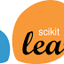
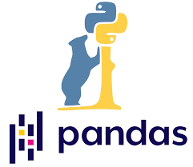

<h1 align="center">Senior Full Stack Engineer</h1>

## About Me

Well-Rounded Senior Software Engineer with a unique blend of AI, full-stack, and cloud engineering, delivering transformative solutions in fast-paced environments for global technology leaders.  
Extensive hands-on experience at enterprise corporations, designing, developing, and deploying high-performance web applications with Python, JavaScript, PHP frameworks and libraries, SQL and NoSQL databases, and DevOps best practices.  
Proficient in rapid prototyping and MVP development at startups and IT services companies, architecting, testing, and launching AI-powered products using LangChain, LangGraph, TensorFlow, and PyTorch, while driving iterative upgrades and rapid expansion across various industries through automatic CI/CD pipelines with Git, Docker, Kubernetes, AWS, and GCP.  

## Skills
<table>  
  <tr> 
    <td align="center" width="90">  
        
       Python  
    </td> 
    <td align="center" width="90">  
        
       Javascript  
    </td>
    <td align="center" width="90">  
        
       TypeScript  
    </td>     
    <td align="center" width="90">  
        
       PHP  
    </td>      
    <td align="center" width="90" align="center" width="90">  
        
       C++  
    </td> 
    <td align="center" width="90">  
      
       HTML  
    </td>  
    <td align="center" width="90">  
        
       CSS  
    </td> 
  </tr>  
  <tr>  
    <td align="center" width="90">  
        
       Laravel  
    </td>
    <td align="center" width="90">  
        
       Node.js  
    </td>   
    <td align="center" width="90">  
        
       Express.js
    </td>
    <td align="center" width="90">  
        
       Nest.js  
    </td>
    <td align="center" width="90">  
        
       Django  
    </td>
    <td align="center" width="90">  
        
       Flask  
    </td>
    <td align="center" width="90">  
        
       FastAPI  
    </td>
  </tr>
  <tr>  
    <td align="center" width="90">  
        
       React  
    </td>
    <td align="center" width="90">  
        
       Next  
    </td>
    <td align="center" width="90">  
        
       Angular  
    </td>
    <td align="center" width="90">  
        
       Vue  
    </td>
    <td align="center" width="90">  
        
       Nuxt  
    </td>
    <td align="center" width="90">  
        
       Electron  
    </td>
    <td align="center" width="90">  
        
       Tailwind  
    </td>
  </tr>
  <tr>  
    <td align="center" width="90">  
        
       MySql  
    </td>
    <td align="center" width="90">  
        
       Postgres  
    </td>
    <td align="center" width="90">  
        
       MongoDB
    </td>
    <td align="center" width="90">  
        
       Elastic
    </td>
    <td align="center" width="90">  
        
       AWS  
    </td>
    <td align="center" width="90">  
        
       Azure  
    </td>
    <td align="center" width="90">  
        
       GCP  
    </td>
  </tr>
  <tr>  
    <td align="center" width="90">  
          
       TensorFlow
    </td>  
    <td align="center" width="90">  
        
       PyTorch  
    </td>
    <td align="center" width="90">  
        
       Keras  
    </td>  
    <td align="center" width="90">  
        
       Scikit  
    </td>  
    <td align="center" width="90">  
        
       LangChain
    </td>   
    <td align="center" width="90">  
        
       Pandas   
    </td>
    <td align="center" width="90">  
        
       OpenCV  
    </td>   
  </tr>
</table>  

## Statistics

